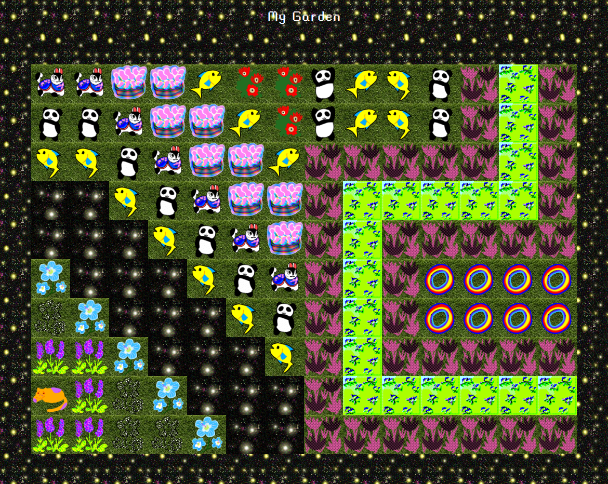
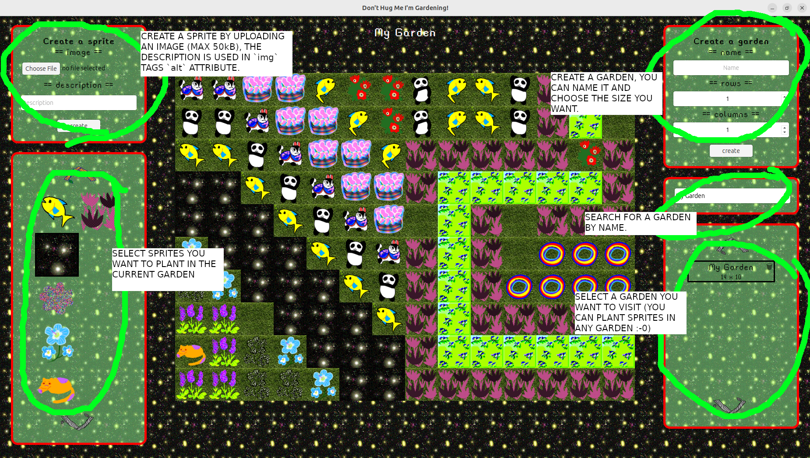

# Don't Hug Me I'm Gardening!



A p2p sprite creating garden building game! Create sprite packs, share them with your friends,
build gardens, _share them with your friends!!_

There are lots of interesting p2p shenanigans going on in the background (you can read about them
below), but first and foremost this is a game, where (see above) you can create sprites and build
gardens.

Powered by p2panda.

## Install

Go to the [releases](https://github.com/sandreae/dont-hug-me-im-gardening/releases) page and
download the latest binary/package compiled for your system.

On a Linux machine there are two options:

### `deb` file

```bash
# download the latest deb file from the releases page
wget https://github.com/sandreae/dont-hug-me-im-gardening/releases/download/<VERSION>/dont-hug-me-im-gardening_<VERSION>_amd64.deb

# install using `apt`
sudo apt install <VERSION>/dont-hug-me-im-gardening_<VERSION>_amd64.deb

# now you can run `dont-hug-me-im-gardening` from the command line like so (you may need to open a new terminal)
dont-hug-me-im-gardening

```

### `AppImage`

```bash
# download the latest AppImage from the releases page
wget https://github.com/sandreae/dont-hug-me-im-gardening/releases/download/<VERSION>/dont-hug-me-im-gardening_<VERSION>_amd64.AppImage

# set executable permission
chmod +x dont-hug-me-im-gardening_<VERSION>_amd64.AppImage

# run the AppImage
./dont-hug-me-im-gardening_<VERSION>_amd64.AppImage
```

I'll update with instructions for other platforms once I've been able to test them myself. If
anyone does this before me, I'd be very happy to hear from you.

## Run

If installed via the `deb` file route then the app can be launched by finding and clicking on it's
app icon. For other installation methods, you can launch the app binary via the command line.

## Use

Using the app is fairly self-explanatory, these are the main features:



## Sharing

`dont-hug-me-im-gardening` is a local-first (it works offline) and social application (you can share
stuff with friends). You can get started creating your sprites and gardens immediately, when
you're ready to share there are several ways to do it.

### Locally

You can share your creations with other people automatically if they are on the same local network
as you. This could be your own home WiFi, or a mobile hotspot. Once you both run the app, then
your devices will find each other and start sharing all data.

WARNING: as this app doesn't deal with inherently sensitive data, the default behavior is that
local sharing is _enabled_. If you don't want this, then you should edit your config file
accordingly (see below).

### Remotely

If you want to discover new peers and/or share remotely, you need to configure your app to do so.
There are two options:
- you know the direct address of a remote peer who you can connect to directly (this could be
  because you are on the same VPN)
- you know the address of a `p2panda` node configured to run as a relay, this node will help you
  discover and connect with new peers who are also interested in _creating and sharing sprite
  packs and gardens!_

Both these approaches require that some infrastructure (beyond simply downloading the app) exists,
and it's understandable if not all users have access to this. If you're interested in trying to
deploy your own p2panda relay, there are deployment resources
[here](https://github.com/sandreae/aquadoggo-deployment-resources). I may provide a public relay
at some point in the future, until then please enjoy sharing with local friends!

## Configuration

`dont-hug-me-im-gardening` is powered by p2panda, which takes care of persisting and exposing a
query interface on your data, as well as discovering and syncing data with your other peers. In
order to configure how, and with who, `dont-hug-me-im-gardening` shares data we need to configure
the p2panda `aquadoggo` node which is running in the background. This is done via a config file
located on linux machines at `$HOME/.local/shared/dont-hug-me-im-scared/config.toml`.

The values you may want to configure are:

```toml
# IP address and exposed UDP port of known relay nodes.
#
# Default is an empty array.
relay_addresses = [
    # "192.0.2.16:2022",
]

# Whether you want to discover (be discoverable) and share with peers on your local network.
#
# Default is `true`
mdns = true

# You yourself want to behave as a relay for other peers.
#
# Default is `false`
relay_mode = false

# IP addresses of peers you can connect to directly.
#
# Default is an empty array.
direct_node_addresses = [
    # "192.0.2.0:2022",
    # "192.0.2.2:3000",
]

# Restrict the peers who can connect to you to a strict "allow" list.
#
# Default is `*` wildcard which means any peer can connect to you.
allow_peer_ids = "*"

```

The ones I outlined above are the values I think are most relevant for `dont-hug-me-im-gardening`
basic use cases. There are other values you can configure though, read more about them on the
`aquadoggo` repo [here](https://github.com/p2panda/aquadoggo/blob/main/aquadoggo_cli/config.toml).

## Sprite Packs

When you install `dont-hug-me-im-gardening` you get some sprites ready for "planting" bundled with
the application. The first (amazing) sprite pack has been contributed by [Mio Ebisu](https://ebisumio.com),
(thank you!!). I'd like to add more in the future, get in touch if you have something to share.

## Development

I chose the tech stack for this app based on tools I already know and care about or ones I'm interested
in learning more about. The idea for the app came while already working with p2panda a lot (I'm a
core maintainer), so that was a given (and it's great for building web apps like this :->). Beside
this, I chose [Web Components](https://developer.mozilla.org/en-US/docs/Web/API/Web_Components)
for building the UI. I like using browser native tech, and I was interested to see how using pure
Web Components in place of common front-end frameworks would feel. This meant I got seduced by the idea of doing a
"no-build" front-end, which is great ;-> (gotta love `npx http-server ./src`), there is only
one dependency, this being the p2panda web client library `shirokuma`, which is included. I'm not so
hardcore that i wanna lose my basic dev tools though, so there linting and formatting dev
dependencies. The final goal was to be able to cross-compile and bundle the app for all common desktop platforms. I chose
[`tauri`](https://tauri.app) for this, which is a framework I've wanted to use more for a while.

With all that in place, the development stack is made up of the following layers:

#### `aquadoggo` + Tauri "back-end"

- `aquadoggo` p2panda node (networking, replication, storage, CRDT, GraphQL API)
- tauri for cross-compiled builds

#### web "front-end"

- html
- css
- JavaScript
  - [shirokuma](https://github.com/p2panda/shirokuma)
  - Web Components
- npm for dev tooling

### `aquadoggo`

`aquadoggo` is a network node developed by the p2panda team (I'm one of them) which aims to
take some of the common challenges out of developing p2p apps. It's written in rust, and in this
project it's imported as a crate into the tauri code and started programmatically in the background.

### Tauri

Tauri is a framework for making cross-compilable apps written in `rust`. You are able to wrap a
web view with backend logic and build binaries for all common desktop environments (mobile coming
soon). There are various config patterns available for safely exposing system access and other
conveniences which are useful when packaging and distributing a application binaries.

All tauri code is in `./src-tauri` and the main config is `tauri-conf.json`. The complete
directory structure is as so:

```bash
tauri-src/
    icons/ # icons sized for all platforms
    resources/ # resources we exposed to the app at runtime
        schemas/ # p2panda schemas deployed to the node on initial startup
        sprite-packs/ # commits containing bundled sprite packs, deployed on initial startup
        config.toml # default aquadoggo config, copied to app data dir on initial startup
    build.rs # tauri build file
    target/ # builds are located here [not tracked]
    tmp/ # temporary app data directory used for development [not tracked]
    cargo.lock # cargo lock file for rust dependencies
    cargo.toml # cargo file for rust dependencies
    tauri.conf.json # tauri config
```

The front-end code is not located here, it's pulled in and wrapped up along with the rust code at
compilation time.

To run the app:

```bash
npm run tauri dev
```

This starts the app in dev mode and will hot-reload when any changes are made.

On first run this will:

- generate and store a private key at `tmp/private-key.txt`
- initiate a SQLite database at `tmp/db.sqlite.3`
- deploy and materialize p2panda schema contained in the `schema.lock` file
- deploy and materialize bundled sprite packs contained in `sprite-packs`

If you want to start-up a fresh node, just delete the contents of `tmp`.

### front-end

The front-end code is located in `./src`. As I mention above, this project has a web front-end
which makes use of Web Components for building the UI. Web Components offer a way to define custom
html tags, which have their own attributes and (JavaScript) instantiation and rendering logic.

All components can be found in `src/components` and the directory structure for each one is as
so:

```bash
components/
  component-name/
    component.js # the component definition and logic
    template.js  # the components html template element
    style.css    # scoped styles for this component
```

To run the front-end along with it's own dedicated `aquadoggo` node you should run:

```bash
npm run tauri dev
```

Alternatively, if you have a local or remote `aquadoggo` node running then you can skip the tauri
step and serve the app directly as a static site, making all requests to the existing node.

If your node isn't accessible from the default location (`http://localhost:2020`) then please
change `NODE_ADDRESS` in `src/constants.js` to the correct value.

Before running the app for the first time, the node must be informed of the required schema. To do this, deploy the
schema from the `schema.lock` file (you only need to do this one time):

```bash
npm run deploy-schema
```

And if you want some initial sprites to play with, also run:

```bash
npm run deploy-sprite-packs
```

Then you can serve the apps static assets and visit it in the browser at `localhost:8080`

```bash
npx http-server ./src
```

From now on this is the only command you need to run as your node will have persisted the schemas
and initial sprite packs.

## Further ideas (suggestions welcome, PRs welcome!)

- [ ] navigate to specific garden using id in url path
- [ ] refresh button which fetches new items on garden and sprites list
- [ ] text search for sprites list
- [ ] explore layering (maybe just two layers) sprites
- [ ] implement "private" gardens (requires schema changes)
- [ ] update interface for sprites and gardens
- [ ] deletion of sprites
- [ ] manual deletion of tile sprites
- [ ] use tauri commands to implement uploading seed data from client
